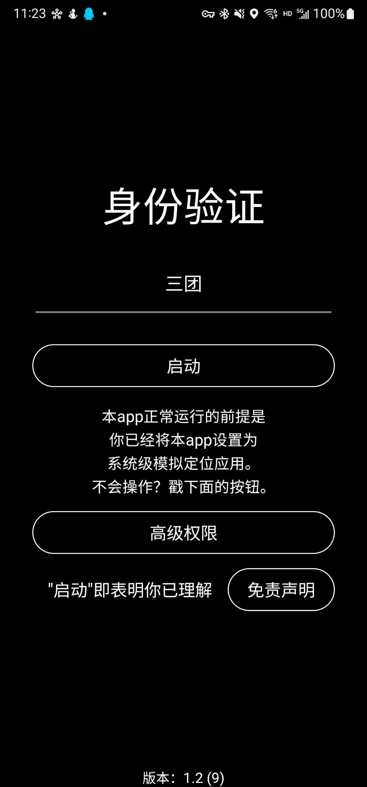
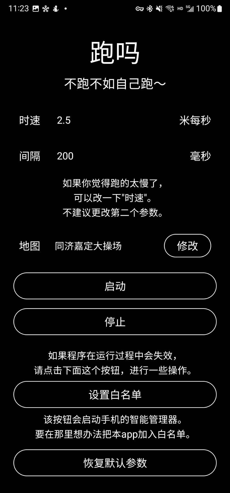

# 跑吗 - 模拟跑步

## 简介

跑吗是一款模拟跑步app，允许在预设的地图上，以自定义速度移动。适用于安卓设备，基于虚拟定位实现。

“跑步”过程会自动对海拔和速度加入小幅度改动，以模拟不精准定位。

软件支持后台运行，以适应某些无法放置在后台的体育app。

本app仅供地理学习与地图开发测试等必要环境使用，请勿用于其他违规活动。使用者因使用本app造成的损失请自负。

## 程序截图

## Star History

